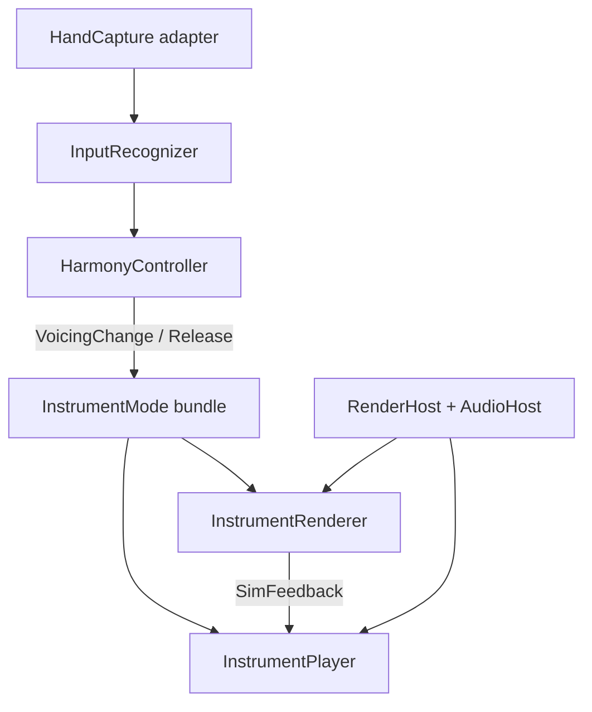

# Instrument architecture

This project is a hand-tracking musical instrument with swappable visualizations and audio engines.
The goal is a **backend-agnostic API** under `src/lib/instrument/` with thin host adapters for p5 (today), Three.js, Web Audio, Tone.js, etc.

## Layers

| Layer | Module | Responsibility |
| --- | --- | --- |
| Capture | Host adapter (ml5 today) | Webcam → `HandSnapshot[]` |
| Input | `instrument/input/` | Gestures → settled `MusicalIntent` |
| Harmony | `instrument/harmony/` + `sketch/harmony.ts` | Intent → MIDI voicings, `VoicingChange` events |
| Renderer | `instrument/renderer/` + mode impls | Sim / viz; returns `SimFeedback` |
| Player | `instrument/player/` + mode impls | Sound from voicing + sim feedback |
| Session | `instrument/session.ts` | Frame loop: input → harmony → player + renderer events |

## Event glossary

| Event | Direction | Purpose |
| --- | --- | --- |
| `VoicingChange` | Harmony → renderer, player | Notes started or changed |
| `ReleaseEvent` | Harmony → renderer, player | All notes released |
| `SimFeedback` | Renderer → player | Lit mass intensity, conversion pings (boids) |
| `InputUpdate` | Input → harmony | Settled intent + raw HUD fields |

Legacy bridge: today's p5 sketch still uses `InstrumentFrame` and `NoteEvent` in `sketch/types.ts`.
The p5 host (`instrumentCore.ts`) delegates music logic to `createInstrumentSession`.

## Mode bundles

Each URL selects a **host + mode** — renderer + player pair.

| Route | Host | Mode | Renderer | Player |
| --- | --- | --- | --- | --- |
| `/strings` | p5 | strings | `sketch/renderers/strings.ts` | p5 strings player |
| `/boids` | p5 | boids | `sketch/renderers/boids.ts` (CPU ~900) | p5 boids player |
| `/gpu/boids` (planned) | WebGL / Three | boids | GPU instanced boids (T3) | same boids player |

**Shader strings** (T4) is a separate future renderer for strings mode on WebGL — not the same as GPU boids.

Render, sim, and audio backends are independent. The high-perf path is **WebGL host + GPU boids renderer**, sharing the same session, input, and UI as p5 routes. See [`THREEJS_MILESTONE.md`](THREEJS_MILESTONE.md).

## Refactor status

| Phase | Status | Description |
| --- | --- | --- |
| A | Done | Types scaffold + this doc |
| B | Done | Extract pure input + voicing from `instrumentCore.ts` |
| C | Done | `HarmonyController` + unified `VoicingChange` |
| D | Done | Extract p5.sound players (`createStringsPlayer`, `createBoidsPlayer`) |
| E | Done | Slim core + unified mode registry + `createInstrumentSession` |
| F | Done | Boids params instance config, follower dot on host |
| T1 | Done | Harmony/HUD types in `instrument/`; no sketch imports in session |
| T2 | Done | `/gpu/boids` WebGL host + session shell + point-cloud placeholder |
| T3 | Pending | Full GPU boids sim port (5k+ particles, parity) |

## Host adapters (planned)

| Adapter | Interface | Current impl |
| --- | --- | --- |
| Capture | `HandCapture` | ml5 in `instrumentCore.ts` |
| Render | `RenderHost` | p5 instance mode |
| Audio | `AudioHost` | Web Audio via p5.sound |

No imports of p5, Three, Tone, or ml5 inside `src/lib/instrument/` interfaces or pure logic modules.
