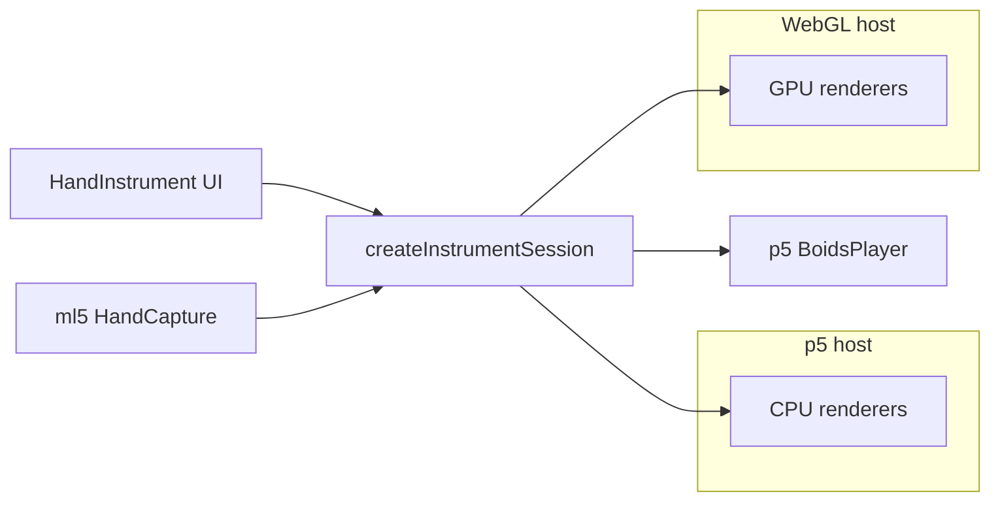

# Visual backends & performance path

The plan mentions **Three.js**, **GPU boids**, and **shader strings** — they are **not** the same thing. They sit at different layers:

| Name | Layer | What it is |
| --- | --- | --- |
| **p5 host** | Host | Canvas2D/WebGL via p5 instance mode (today) |
| **WebGL host** | Host | Three.js canvas + rAF loop (T2) |
| **CPU boids** | Renderer | ~900 JS objects, p5 radial gradients (today) |
| **GPU boids** | Renderer | Instanced points/mesh + SoA sim (T3) — **the perf path** |
| **Shader strings** | Renderer | GPU string curves (T4) — **optional**, separate from boids |

**Host** = who owns the canvas and frame loop.  
**Renderer** = how a mode is drawn and simulated.  
**Player** = audio (unchanged for now — same p5.sound boids player).

So: Three.js is the **platform** for the fast boids mode; “shaders” are **how** that mode (or strings) draws, not a duplicate of Three.js.

---

## Recommended product split (separate routes, shared UI)

Keep today’s p5 modes as-is. Add a **GPU boids** route that reuses the same HUD, gesture controls, key/mode pickers, and boids tuning panel.

| Route | Host | Renderer | Particles | Purpose |
| --- | --- | --- | --- | --- |
| `/strings` | p5 | strings (2D) | ~49 strings | Default plucked viz |
| `/boids` | p5 | boids CPU | ~900 | Murmur; works everywhere |
| `/gpu/boids` | WebGL (Three) | boids GPU | 5k–50k+ | Perf + effects (goal) |

Later (optional, separate):

| Route | Host | Renderer |
| --- | --- | --- |
| `/gpu/strings` | WebGL | shader strings (T4) |

Same **input → session → player** pipeline for all routes. Only host + renderer swap.

---

## GPU boids — perf goals (same controls, more headroom)

Shared with CPU boids today:

- Hand gestures, chord settle, voicing, infection rules, decay-to-dead
- Boids params panel (presets, wind, infection, etc.)
- `SimFeedback` → player intensity + conversion pings

GPU-specific upgrades (incremental):

1. **T3a** — Three instanced points, CPU sim port, ~5k boids, parity behavior
2. **T3b** — SoA typed arrays, MIDI buckets, higher counts
3. **T3c** — WebGPU compute flocking (grid hash on GPU), hybrid CPU voicing/infection seeds
4. **T3d** — 50k particles, GPU lit/decay/infection, GPU reduction → `audioMix.intensity`
5. **Effects** — trails, infection ripples, chord-repel shockwave (shader-only, no gesture changes)

### T3c implementation plan (in progress)

| Pass | Where | Work |
| --- | --- | --- |
| Bootstrap | `src/lib/gpu/compute/` | `detectWebGPU`, renderer factory, WGSL flocking stub |
| Sim | WebGPU compute | SoA pos/vel/lit buffers, grid hash, sep/align/coh |
| Logic | CPU session | Voicing events → GPU uniform buffer (notes, quota, repel) |
| Render | Three.js | Instanced points from GPU buffer (no readback) |
| Audio | CPU + 1 float readback | Parallel sum of `lit` → player intensity |

Fallback: CPU sim + Three render (current `/gpu/boids`) when WebGPU unavailable.

---

## Milestone T1 — Shared core package

**Goal:** `src/lib/instrument/` has no p5 / Three / ml5 imports in pure modules.

| Task | Notes |
| --- | --- |
| Move `sketch/harmony.ts` → `instrument/harmony/scales.ts` | Re-export from sketch for compat |
| Move `InstrumentHudState`, `RendererAudioMix`, `RenderModeId` → instrument | Session stops importing sketch/types |
| `npm run check` + `npm test` | CI gate |

---

## Milestone T2 — WebGL host shell

**Goal:** `/gpu/boids` route with session + audio + placeholder or T3a renderer.

| Task | Notes |
| --- | --- |
| `createWebGLHost` | Three renderer, resize, rAF |
| `createMl5Capture` | Shared `HandCapture` (extract from instrumentCore) |
| `HandInstrument` `host` prop | `'p5' \| 'gpu'` selects sketch vs WebGL bootstrap |
| Hidden p5 instance | Audio only until Web Audio player exists |

**Acceptance:** Same UI; gestures change chord; WebGL canvas draws; audio matches `/boids`.

---

## Milestone T3 — GPU boids renderer

See phases T3a–T3c above.

**Acceptance:** Decay-to-dead, infection, intensity track CPU mode; stable at target particle count.

---

## Milestone T4 — Shader strings (optional, separate)

GPU displacement strings — **not** required for GPU boids. Only if we want a perf strings mode later.

---

## Suggested PR sequence

1. `refactor/instrument-core-boundary` — T1
2. `feat/shared-instrument-ui-host-prop` — `host='p5'|'gpu'`, no new viz yet
3. `feat/gpu-boids-shell` — T2 route + empty Three scene + session
4. `feat/gpu-boids-cpu-port` — T3a parity at ~5k
5. `feat/gpu-boids-soa` — T3b scale
6. `feat/gpu-boids-compute` — T3c + effects

---

## Verification

- Manual webcam test on `/boids` and `/gpu/boids` after each PR
- `npm run check`, `npm test`, `npm run build`
- HUD + boids preset panel behave identically on both routes
